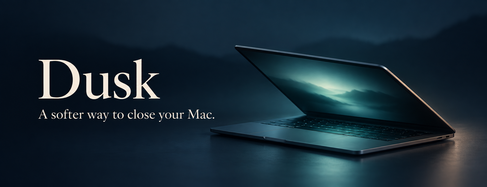
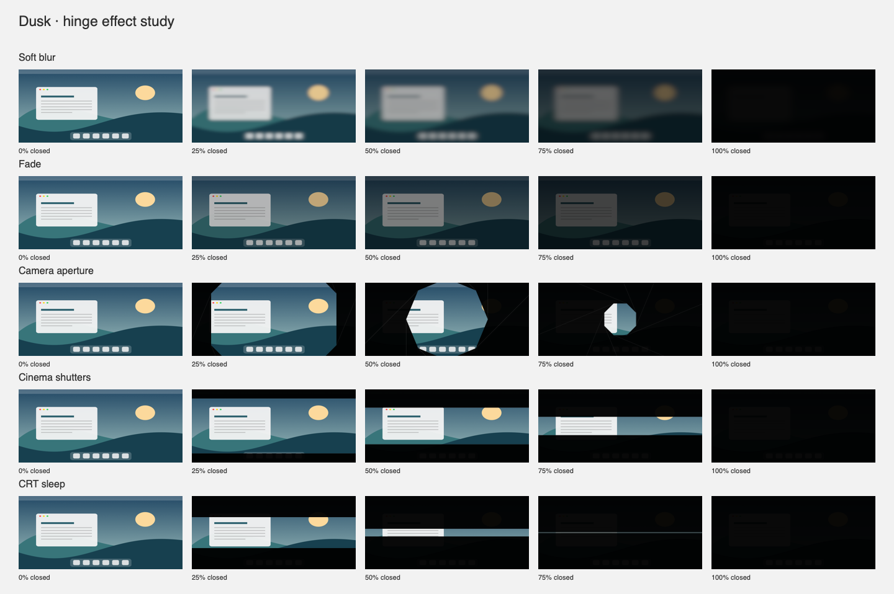

# Dusk



[](https://github.com/neeraj15022001/dusk/actions/workflows/ci.yml)
[](LICENSE)
[](#compatibility)
[](AI_POLICY.md)

**Close your lid. Let the desktop fade with it.**

Dusk is a native macOS menu bar app that follows your MacBook's hinge angle. Five reversible effects gradually soften, dim, or close over the built-in display. Stop halfway and the effect holds; reopen and the screen clears.

No desktop recording, telemetry, network service, or third-party package dependencies. Built with Swift, SwiftUI, AppKit, and IOKit.

[Get started](#build-and-run) · [Effects](#effects) · [Contribute](CONTRIBUTING.md) · [AI disclosure](AI_POLICY.md) · [Changelog](CHANGELOG.md)

## Compatibility

- **macOS 13+**, Swift 5.9+, and Xcode Command Line Tools to build.
- Automatic effects need a MacBook exposing a compatible Apple HID hinge angle sensor. Development checks ran on an M3 MacBook Air; other models and the oldest deployment target are not certified.
- Unsupported sensors leave the desktop clear. The illustrated angle simulator and four-second preview remain available.
- Effects affect the **built-in display only**. See [testing and hardware evidence](docs/TESTING.md).

## Build and run

The initial release is **source-first**. No Developer ID signed or notarized download is supplied. Install Command Line Tools with `xcode-select --install` if needed, then:

```sh
git clone https://github.com/neeraj15022001/dusk.git
cd dusk
bash scripts/build-app.sh
open dist/Dusk.app
```

The script builds for your Mac's architecture, assembles `dist/Dusk.app`, includes licensing notices, and applies an ad-hoc signature. No full Xcode project is required. Quit any running Dusk instance before opening a rebuilt copy.

The app opens settings and adds a moon icon to the menu bar. Closing settings leaves Dusk running. Choose **Quit Dusk** from that menu or press **Command–Q** in settings to stop it. To uninstall, quit and remove `Dusk.app`.

## Use

- **Enabled** turns automatic hinge effects on or off.
- **Effect** selects the animation, also available from the menu bar. Your choice and existing thresholds are preserved between launches. Retired or unrecognized saved selections fall back to Soft blur without changing other settings.
- **Start fading** defaults to **65°**. Above this angle the desktop is clear.
- **Reach darkness** defaults to **8°**. Below it the full configured effect is applied.
- **Darkness** defaults to **96%** and **Blur** to **100%**.
- Drag **Try an angle** to explore an illustrated preview without changing your screen. **Return to live** follows the real hinge again.
- **Preview on screen** runs a four-second desktop effect and returns to the live hinge angle. Its peak dimming/mask opacity is limited to 65%. **Stop preview** ends it without changing Enabled.
- **Control–Option–Command–K** immediately pauses Dusk and clears the screen. Escape does the same while settings has keyboard focus. If the shortcut is already registered by another app, use the menu bar pause control.

The effect follows position, including when the lid stops moving halfway down. It affects the built-in display only. Dusk does not change hardware brightness, intercept mouse events, prevent sleep, or launch automatically at login.

## Effects

| Effect | Closing behavior |
| --- | --- |
| Soft blur | Live macOS backdrop blur blends in before darkness |
| Fade | Smooth, uniform fade without blur or geometry |
| Camera aperture | Eight rotating iris blades close around the center |
| Cinema shutters | Top and bottom curtains meet in the middle |
| CRT sleep | Visible area narrows to a glowing line, then a point |



macOS **Reduce Motion** substitutes Fade while preserving your selected effect. Blur control applies to Soft blur. CRT has a single position-driven glow, with no flashing or strobing.

## How it works

1. `HingeSensor` discovers an Apple HID device with usage page `0x20` and usage `0x8A`, without hard-coding a product ID. It opens the device non-exclusively and reads feature report `1` on a serial worker queue at 30 Hz.
2. `EffectCurve` maps the angle between the two thresholds to a bounded smoothstep curve. Blur arrives early; dimming builds later. A short, time-based filter smooths sensor steps.
3. `OverlayController` shows a transparent, non-activating, click-through panel over the built-in screen and across Spaces. `NSVisualEffectView` supplies Soft blur; a black layer supplies dimming. `EffectArtworkView` draws the aperture/shutter/CRT masks, shared with the miniature preview.

**Soft blur behavior:** public AppKit materials provide a system-controlled blur radius. Dusk progressively blends that live blurred material over the desktop; it does not directly change the system blur radius. The miniature illustration uses a variable Gaussian radius to communicate the effect. Reduce Transparency and OS material behavior can change the appearance. Dusk does not capture the desktop or request Screen Recording, Accessibility, administrator, microphone, or network access.

The Apple sensor report is hardware-dependent and is not a stable, documented high-level macOS hinge API. Unsupported or unreadable sensors show an actionable status and leave the desktop clear. Dusk retries discovery, clears stale readings after 750 ms, and releases the overlay on sleep, session deactivation, pause, and quit. After wake it waits for a fresh reading. Normal macOS sleep can take over before the configured dark angle is reached.

## Verify

```sh
bash scripts/test.sh
dist/Dusk.app/Contents/MacOS/Dusk --probe
dist/Dusk.app/Contents/MacOS/Dusk --render-effects /tmp/dusk-effects.png
```

The probe reads the real hinge once, prints the angle, and exits without opening a window or overlay. Tests cover all effect endpoints, monotonic closure geometry, invalid values, effect limits, and HID report validation. The render command creates a contact sheet from generated artwork. CI verifies checks and the app build; it cannot test a physical hinge.

Manual acceptance checks on a supported MacBook:

1. With the lid above the start angle, verify that the desktop is clear.
2. Slowly lower the lid; confirm increasing blur then dimming. Hold partway down; the effect should hold steady.
3. Reopen; confirm full clarity returns. Test the emergency pause shortcut.
4. Try the four-second preview; verify automatic clearing and normal mouse interaction.
5. Sleep and wake, switch Spaces, and enter a full-screen app; verify recovery and that external displays remain unchanged.
6. Try each effect in settings and the menu bar; quit/reopen to verify selection persistence.

## Contributing and community

Small fixes, compatibility reports, accessibility improvements, and clear documentation are welcome. Read [CONTRIBUTING.md](CONTRIBUTING.md) before opening a pull request. Neeraj Gupta ([@neeraj15022001](https://github.com/neeraj15022001)) maintains the project and reviews changes.

- [Bug reports and feature requests](https://github.com/neeraj15022001/dusk/issues/new/choose)
- [Support](SUPPORT.md) and [Code of Conduct](CODE_OF_CONDUCT.md)
- [Private security reporting](SECURITY.md)
- [Testing](docs/TESTING.md) and [release checklist](docs/RELEASING.md)

## Built with AI assistance

Dusk was developed with substantial OpenAI Codex assistance under the maintainer's direction. Code, tests, documentation, and banner artwork received AI assistance. Automated checks and development hardware observations are documented; no independent security audit is claimed. See [AI_POLICY.md](AI_POLICY.md) for provenance and contribution expectations, and [asset notes](docs/ASSETS.md) for the banner prompt.

## License and acknowledgements

Released under the [MIT License](LICENSE). Retain its copyright and permission notice when redistributing the software.

Thanks to [Sam Gold's LidAngleSensor research](https://github.com/samhenrigold/LidAngleSensor) for hardware protocol insights. Dusk is an independent implementation and is not affiliated with Apple. See [third-party notes](THIRD_PARTY_NOTICES.md) for references, platform APIs, and asset provenance.
